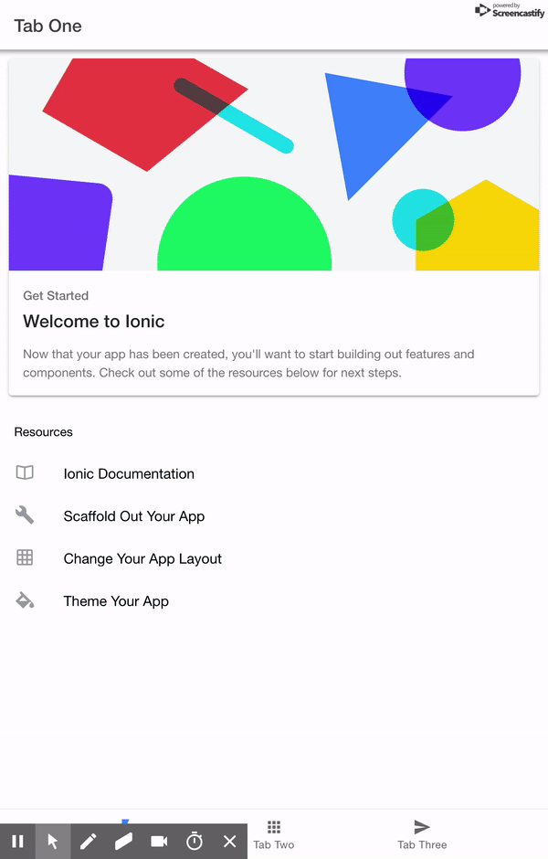

# IonicMasterDetailTabs

Sample project that shows how to build a master detail app with tabs.

Technologies: Ionic, TypeScript.


## App Example



## Running

Before you go through this example, you should have at least a basic understanding of Ionic concepts. You must also already have Ionic installed on your machine.

* Test in localhost:

To run it, cd into `ionic-master-detail-tabs` and run:

```bash
npm install
ionic serve
```

## Requirements

* [Node.js](http://nodejs.org/)
* [Ionic](https://ionicframework.com/getting-started#cli)
